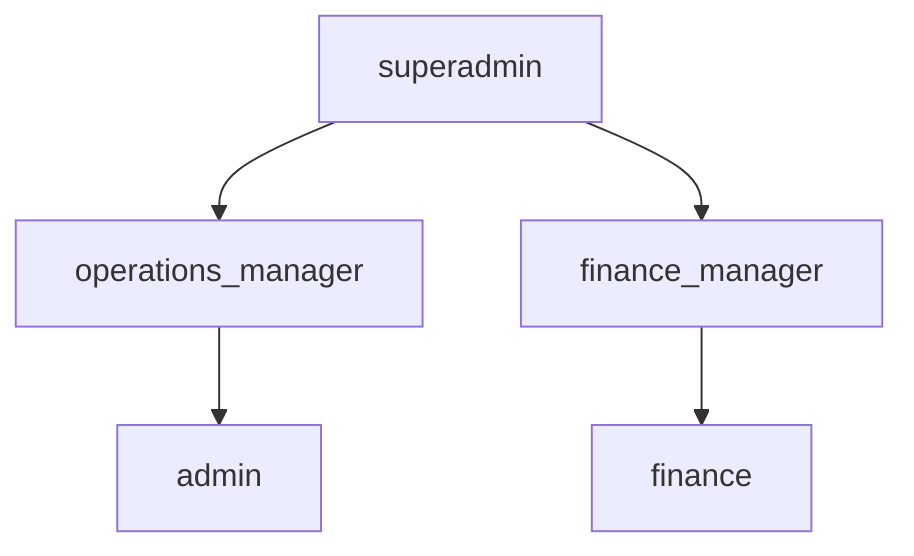
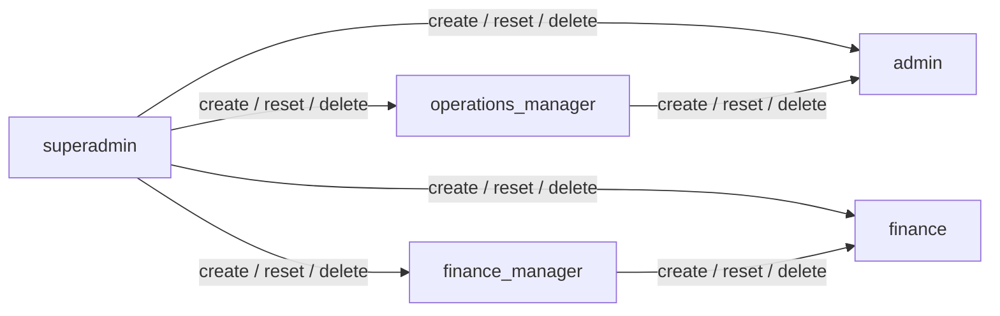
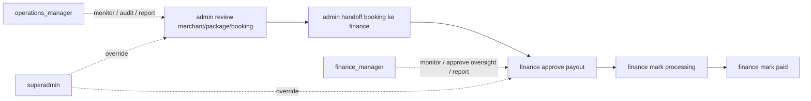

# Diagram Role dan Account Lifecycle

Dokumen ini menyajikan diagram ringkas untuk hierarki role internal dan lifecycle pengelolaan akun antar role.

## 1. Hierarki Role

Makna diagram:

- `superadmin` berada di puncak dua jalur
- jalur operasional: `operations_manager` memimpin `admin`
- jalur finance: `finance_manager` memimpin `finance`

## 2. Lifecycle Akun Internal

Aturan utamanya:

- `operations_manager` hanya mengelola akun `admin`
- `finance_manager` hanya mengelola akun `finance`
- `superadmin` bisa mengelola seluruh struktur manager dan executor

## 3. Alur Operasional

Makna diagram:

- `admin` adalah executor operasional
- `operations_manager` memonitor, mengarahkan prioritas, dan mengelola akun admin
- `finance` menjalankan payout
- `finance_manager` memonitor queue finance, melihat aging, mengelola akun finance, dan mengirim laporan
- `superadmin` memegang override lintas jalur

## 4. Prinsip Singkat

- manager tidak otomatis menjadi executor
- manager memegang kontrol tim, kualitas, audit, dan pelaporan
- executor memegang aksi rutin yang menyentuh status bisnis
- audit log wajib menangkap semua lifecycle akun internal

Dokumen ini melengkapi:

- `docs/role-matrix.md`
- `docs/role-matrix-checklist.md`
- `docs/internal-account-lifecycle.md`
- `docs/finance-role-audit.md`
